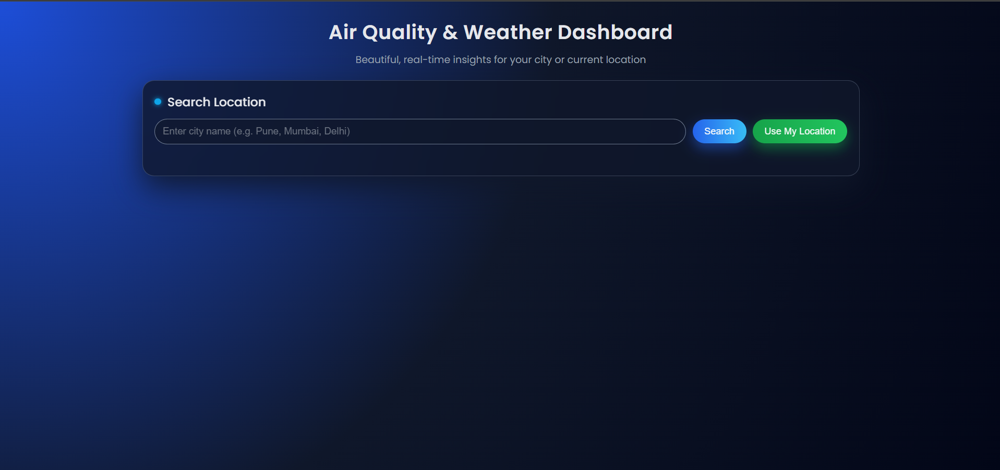
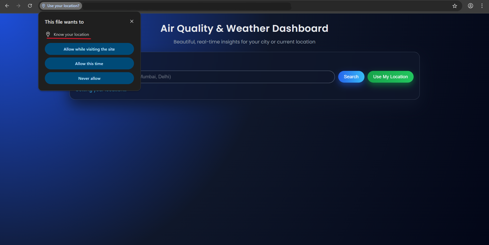
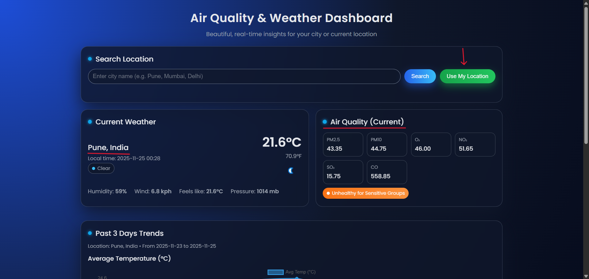
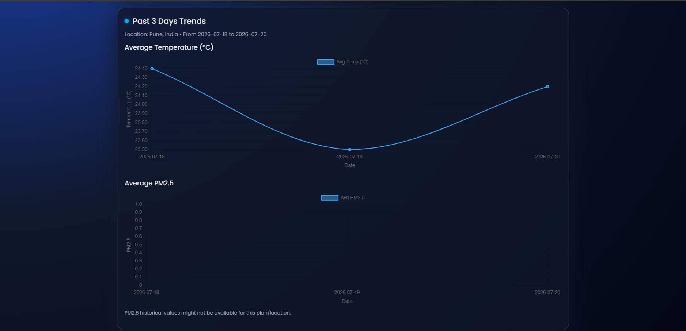

# Air Quality Monitoring Dashboard

A real-time web-based Air Quality Monitoring Dashboard that provides location-based environmental information using the **World Air Quality Index (WAQI) API**. The application automatically detects the user's current location, retrieves live air quality data, and presents it through a clean, responsive, and interactive dashboard.

This project was developed as a **Third Year B.Sc. Computer Science Group Project** to demonstrate the practical implementation of API integration, full-stack web development, and real-time environmental data visualization using Python Flask.

---

## Table of Contents

- [Overview](#overview)
- [Features](#features)
- [Technology Stack](#technology-stack)
- [Project Structure](#project-structure)
- [Project Preview](#project-preview)
- [Working Principle](#working-principle)

---

# Overview

Air pollution has become one of the most significant environmental challenges affecting human health and the environment. Although many online platforms provide air quality information, most require manual location input or display generalized data that may not accurately represent the user's surroundings.

The **Air Quality Monitoring Dashboard** solves this problem by automatically detecting the user's current location and displaying real-time environmental information through an intuitive web interface.

Using the **Browser Geolocation API**, the application captures the user's latitude and longitude and securely sends them to a **Flask backend**, which communicates with the **World Air Quality Index (WAQI) API**. The backend processes the API response and returns only the required information to the frontend for display.

The dashboard provides real-time information such as:

- Air Quality Index (AQI)
- PM2.5 Concentration
- PM10 Concentration
- Carbon Dioxide (CO₂)
- Temperature
- Humidity
- Weather Conditions
- Air Quality Graphs

This project demonstrates practical implementation of:

- REST API Integration
- Client-Server Architecture
- Browser Geolocation API
- JSON Data Processing
- Responsive Web Development
- Python Flask Backend

---

# Features

- Automatic location detection using Browser Geolocation API.
- Real-time Air Quality Index (AQI) monitoring.
- Live PM2.5 and PM10 concentration values.
- Carbon Dioxide (CO₂) monitoring.
- Temperature and humidity information.
- Current weather conditions.
- Dynamic graphical representation of environmental data.
- Responsive design for desktop and mobile devices.
- Flask-based backend for secure API communication.
- JSON data parsing and processing.
- Fast and lightweight application.
- Easy deployment and maintenance.
- Modular architecture for future scalability.

---

# Technology Stack

| Category | Technologies |
|----------|--------------|
| Frontend | HTML5, CSS3, JavaScript |
| Backend | Python, Flask |
| API | World Air Quality Index (WAQI), Browser Geolocation API |
| Libraries | Flask, Requests |
| Development Tools | Visual Studio Code, Git, GitHub |
| Browser Support | Google Chrome, Microsoft Edge, Mozilla Firefox |

---

# Project Structure

```text
Air-Quality-Monitoring-Dashboard/
│
├── Assets/
│   ├── HOME.png
│   ├── Location_Permission.png
│   ├── current_weather.png
│   └── Graph.png
│
├── Documents/
│   └── Tech_For_Air_Quality_Monitoring.pdf
│
├── static/
│   ├── css/
│   ├── js/
│   └── images/
│
├── templates/
│   └── index.html
│
├── app.py
├── requirements.txt
├── README.md
└── .gitignore
```

The project follows a client-server architecture where the frontend communicates with a Flask backend, which retrieves real-time environmental data from the WAQI API and returns the processed information to the dashboard.

---

# Project Preview

## Home Page



The home page introduces the dashboard and provides users with a clean interface to begin monitoring air quality based on their current location.

---

## Location Permission



The application requests permission to access the user's location using the Browser Geolocation API. Once permission is granted, the geographical coordinates are securely sent to the Flask backend.

---

## Current Weather & Air Quality Dashboard



The dashboard displays real-time environmental information including:

- Air Quality Index (AQI)
- PM2.5
- PM10
- Carbon Dioxide (CO₂)
- Temperature
- Humidity
- Weather Conditions

All information is retrieved dynamically through the WAQI API.

---

## Air Quality Graph



The graphical visualization provides an easy-to-understand representation of air quality data, allowing users to compare environmental parameters more effectively.

---

# Working Principle

The Air Quality Monitoring Dashboard follows a simple client-server workflow.

1. The user opens the web application.

2. The browser requests permission to access the user's current location.

3. The Browser Geolocation API retrieves the latitude and longitude.

4. The coordinates are sent securely to the Flask backend.

5. Flask creates a request to the World Air Quality Index (WAQI) API.

6. The WAQI API returns environmental information in JSON format.

7. Flask extracts the required parameters.

8. The processed data is sent back to the frontend.

9. The dashboard updates automatically and displays:

   - Air Quality Index (AQI)
   - PM2.5
   - PM10
   - Carbon Dioxide (CO₂)
   - Temperature
   - Humidity
   - Weather Information
   - Air Quality Graphs

---

---

# System Architecture

The Air Quality Monitoring Dashboard follows a **Client-Server Architecture**, where the frontend is responsible for user interaction and visualization, while the backend handles API communication and data processing.

```
                          +-----------------------+
                          |        User           |
                          +----------+------------+
                                     |
                                     |
                              Opens Dashboard
                                     |
                                     ▼
                    +-------------------------------+
                    |      Browser (Frontend)       |
                    | HTML • CSS • JavaScript       |
                    +---------------+---------------+
                                    |
                     Requests Location Permission
                                    |
                                    ▼
                    +-------------------------------+
                    |   Browser Geolocation API     |
                    +---------------+---------------+
                                    |
                          Latitude & Longitude
                                    |
                                    ▼
                    +-------------------------------+
                    |      Flask Backend (Python)   |
                    +---------------+---------------+
                                    |
                          HTTP Request to WAQI API
                                    |
                                    ▼
               +-------------------------------------------+
               | World Air Quality Index (WAQI) API Server |
               +----------------+--------------------------+
                                |
                           JSON Response
                                |
                                ▼
                    +-------------------------------+
                    |     Flask Data Processing     |
                    +---------------+---------------+
                                    |
                         Extract Required Parameters
                                    |
                                    ▼
                    +-------------------------------+
                    |      Browser Dashboard        |
                    +-------------------------------+

            Displays:
            • AQI
            • PM2.5
            • PM10
            • CO₂
            • Temperature
            • Humidity
            • Weather Information
            • Air Quality Graphs
```

---

# API Workflow

The application relies on the **World Air Quality Index (WAQI) API** to retrieve real-time environmental information.

## Workflow

```
User
   │
   ▼
Browser Requests Location Permission
   │
   ▼
Browser Geolocation API
   │
   ▼
Latitude & Longitude
   │
   ▼
Flask Backend
   │
   ▼
WAQI API Request
   │
   ▼
WAQI Server
   │
   ▼
JSON Response
   │
   ▼
Flask Data Processing
   │
   ▼
Frontend Dashboard
   │
   ▼
Display Environmental Data
```

---


# Installation Guide

Follow the steps below to set up the project on your local machine.

## 1. Clone the Repository

```bash
git clone https://github.com/your-username/Air-Quality-Monitoring-Dashboard.git
```

---

## 2. Navigate to the Project Directory

```bash
cd Air-Quality-Monitoring-Dashboard
```

---

## 3. Create a Virtual Environment (Recommended)

### Windows

```bash
python -m venv venv
venv\Scripts\activate
```

### Linux / macOS

```bash
python3 -m venv venv
source venv/bin/activate
```

---

## 4. Install Required Dependencies

```bash
pip install -r requirements.txt
```

---

## 5. Configure the WAQI API Key

Open the backend configuration file and replace the existing API key with your own WAQI API key.

Example:

```python
API_KEY = "YOUR_WAQI_API_KEY"
```

You can obtain a free API key from:

https://aqicn.org/data-platform/token/

---

## 6. Run the Flask Application

```bash
python app.py
```

---

## 7. Open the Application

Open your browser and visit:

```
http://127.0.0.1:5000
```

Allow location permission when prompted.

The dashboard will automatically retrieve your current location and display live air quality information.

---

# Advantages

The proposed system offers several advantages over traditional static air quality monitoring websites.

- Real-time air quality monitoring.
- Automatic location detection.
- Live environmental data.
- Responsive user interface.
- Platform-independent web application.
- Lightweight and fast performance.
- Simple deployment process.
- Easy integration with external APIs.
- Clean and modular architecture.
- Easy maintenance and future scalability.
- No dedicated hardware required.
- Improved environmental awareness.

---

# Limitations

Although the project successfully provides live environmental monitoring, there are a few limitations.

- Internet connection is required.
- Depends on the availability of the WAQI API.
- Browser location permission is mandatory.
- Historical air quality data is not stored.
- Offline functionality is not available.
- No user authentication system.
- Limited environmental parameters depending on API availability.
- Accuracy depends on the external API provider.
- No cloud deployment in the current version.

---

# Project Documentation

The complete project report is available in the **Documents** folder.

```
Documents/
└── Tech_For_Air_Quality_Monitoring.pdf
```

The report includes:

- Abstract
- Problem Statement
- Objectives
- System Analysis
- System Design
- Working Procedure
- Implementation Details
- Screenshots
- Future Scope
- Conclusion

For a detailed explanation of the project, architecture, implementation, and research work, refer to:

```
Documents/Tech_For_Air_Quality_Monitoring.pdf
```

---

---

# Future Implementations

The current version of the Air Quality Monitoring Dashboard provides a solid foundation for real-time environmental monitoring. Several enhancements can be incorporated in future versions to improve functionality, scalability, and user experience.

## Planned Enhancements

- Integration with IoT-based air quality sensors for real-time hardware monitoring.
- Historical data storage for long-term environmental analysis.
- Machine Learning models for Air Quality Index (AQI) prediction.
- AI-powered health recommendations based on pollution levels.
- Interactive pollution heat maps for better geographical visualization.
- Smart City integration for centralized environmental monitoring.
- Android and iOS mobile applications.
- Email and SMS alert system for hazardous air quality conditions.
- Push notifications for significant environmental changes.
- Cloud deployment for improved scalability and accessibility.
- Support for multiple Air Quality APIs.
- User authentication and personalized dashboards.
- Pollution trend analysis using historical datasets.
- Weather forecasting integration.
- Voice assistant support for hands-free interaction.

---

# Learning Outcomes

This project provided practical experience in several areas of software development and environmental data processing.

During the development of this project, we gained experience in:

- Building responsive web applications.
- Developing backend applications using Python Flask.
- REST API integration and communication.
- Working with JSON data.
- Browser Geolocation API implementation.
- Client-Server Architecture.
- Frontend and Backend integration.
- Git and GitHub version control.
- Project documentation and software development practices.
- Problem solving through real-world application development.

---

# Project Highlights

- Real-time Air Quality Monitoring Dashboard.
- Automatic user location detection.
- Integration with the World Air Quality Index (WAQI) API.
- Flask-based backend architecture.
- Responsive web interface.
- Dynamic environmental data visualization.
- Interactive air quality graphs.
- Modular project structure.
- Easy deployment and maintenance.

---

# Contributors

This project was developed as a **Third Year B.Sc. Computer Science Group Project**.

| Name |
|------|
| Parth Bapat |
| Bhushan Kadam |
| Nayna Ambekar |
| Payal Kasar |

---

# References

The following resources were used during the development of this project.

- World Air Quality Index (WAQI)
- Flask Documentation
- Python Documentation
- GitHub Documentation
- Mozilla Developer Network (MDN)
- WeatherAPI Documentation

---

# License

This project has been developed for academic and educational purposes.

You are welcome to use this project as a learning resource. If you plan to use or modify the project for your own work, please provide appropriate credit to the original contributors.

---

# Repository Information

**Project Name**

Air Quality Monitoring Dashboard

**Project Category**

Web-Based Environmental Monitoring System

**Project Type**

Academic Project

**Academic Level**

Third Year B.Sc. Computer Science

**Programming Languages**

- HTML5
- CSS3
- JavaScript
- Python

**Framework**

- Flask

**API Used**

- World Air Quality Index (WAQI) API
- Browser Geolocation API

**Development Tools**

- Visual Studio Code
- Git
- GitHub

---

# Conclusion

The Air Quality Monitoring Dashboard demonstrates how modern web technologies can be combined to build a practical, location-aware environmental monitoring application.

By integrating Browser Geolocation, a Flask backend, and the World Air Quality Index (WAQI) API, the application delivers accurate, real-time air quality information through a clean and responsive interface.

Beyond fulfilling its academic objective, the project provided valuable experience in full-stack web development, REST API integration, JSON data processing, client-server communication, and software project management. The modular architecture also provides a strong foundation for future enhancements such as IoT integration, predictive analytics, cloud deployment, and smart city applications.

This project reflects our effort to develop a meaningful solution that combines software engineering concepts with real-world environmental awareness.

---

## Repository Maintained By

**Parth Bapat**

If you found this project helpful or interesting, consider giving the repository a star.
